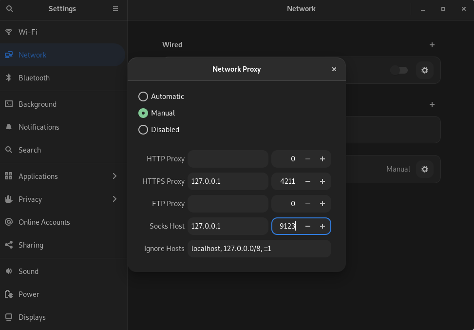

# How to create your private tor bridge

## Table of contents

   1. [Get VPS](#get-vps)
   2. [Server Config](#server-config)
   3. [Client Config](#client-config)
   4. [Use Tor System-Wide](#system-wide)
   5. [SSHTunneling](#sshtunneling)

## [Get VPS](#get-vps)
You can get VPS with cryptocurrency from one of these [companies.](https://bitcoin-vps.com/)You must rent a VPS with 1 core CPU and 512 Mbyte of RAM minimum and install a linux distro on it.

## [Server Config](#server-config)
Login to your VPS with root access.Then update your repositories.
```sh
apt update
apt upgrade
```
Then install these two packages.
```sh
apt install tor obfs4proxy
```
Now we must config tor.Open `/etc/tor/torrc` and write these.For explanation, look at the table.
```sh
BridgeRelay 1
AssumeReachable 1
ORPort 7755
BridgeDistribution none
PublishServerDescriptor 0
ExitPolicy reject *:*
ServerTransportPlugin obfs4 exec /usr/bin/obfs4proxy
ServerTransportListenAddr obfs4 0.0.0.0:7233
ClientTransportPlugin obfs4 exec /usr/bin/obfs4proxy
ExtORPort auto
ContactInfo youremail@gmail.com
Nickname MyBridge
```
<table>
   <tr>
      <th>Variale</th>
      <th>Value</th>
      <th>Required</th>
   </tr>
   <tr>
      <td>ORPort</td>
      <td>You can set anything you want</td>
      <td>&#9745;</td>
   </tr>
   <tr>
      <td>PublishServerDescriptor</td>
      <td>If you want to publish your bridge in tor network, set this 1</td>
      <td>&#9745;</td>
   </tr>
   <tr>
      <td>ServerTransportListenAddr</td>
      <td>You need to set the obfs4 port in this.leave ip to localhost.We use this port after</td>
      <td>&#9745;</td>
   </tr>
   <tr>
      <td>ContactInfo</td>
      <td>Your email address</td>
      <td>&#9746;</td>
   </tr>
   <tr>
      <td>Nickname</td>
      <td>A name for your bridge</td>
      <td>&#9746;</td>
   </tr>
</table>
Save the file and restart your tor service.

```sh
systemctl restart tor@default.service
```
You can monitor your tor service with this command.You must see `Bootstrapped 100% (done): Done` after a while.

```sh
journalctl -e -u tor@default.service
```
Now, you must get your bridge information.You can see the fingerprint in the command above.pay attention, we don't use the hashes.your fingerprint is something like this:

```sh
K3KLGK44LKKJKLN54LLKD649FE491FF9BA6EA5F9
```
Then open `/var/lib/tor/pt_state/obfs4_bridgeline.txt`.In this file you can see your bridge that you must replace your vps information in the variables in your client.Don't change anything in this file on your server.

We done with the server.

## [Client Config ](#client-config)
In your client system install these packages too.

```sh
apt install tor obfs4proxy
```
open `/etc/tor/torrc` file and enter it.

```sh
UseBridges 1
ClientTransportPlugin obfs4 exec /usr/bin/obfs4proxy

Bridge obfs4 <server ip>:<server obfs4 port> <fingerprint> cert=<cert>

HTTPTunnelPort 4211
SocksPort 9123
```
For example:

```sh
UseBridges 1
ClientTransportPlugin obfs4 exec /usr/bin/obfs4proxy

Bridge obfs4 157.211.202.160:7233 07784768F54CF66F9D588E19E8EE3B0FA702711B cert=m3jPGnUyZMWHT9Riioob95s1czvGs3HiZ64GIT3QbH/AZDVlF/YEXu/OtyYZ1eObKnTjcg iat-mode=0

HTTPTunnelPort 4211
SocksPort 9123
```

Save the file and restart your tor service.

```sh
systemctl restart tor@default.service
```
If you connected successfully, you can see `Bootstrapped 100% (done): Done` in `journalctl -e -u tor@default.service` command.

## [Use Tor System-Wide](#system-wide)
You can skip the whole your client system traffic from tor. In other words, you can use tor as a VPN.For this you must set `HTTPTunnelPort` and `SocksPort` in your system settings like this in gnome.You can find these ports in client config.



## [SSHTunneling](#sshtunneling)
If you live in a country where you were unable to connect in the previous step due to censorship, there is a solution for you.You can use ssh local port forwarding over the tor.

We create a local port with ssh, for example `8080`, then we tunnel this port to server obfs4 port.After that, we config client tor to connect to ssh local port.

For this, first enter this command.

```sh
ssh -L 8080:127.0.0.1:7233 <vps user>@<vps ip>
```
Then you must enter your vps password.Pay attention, `8080` is your ssh local port and `7233` is your vps obfs4 port.

Now config your client bridge in `/etc/tor/torrc` to connect to your ssh port.

```ssh
UseBridges 1
ClientTransportPlugin obfs4 exec /usr/bin/obfs4proxy

Bridge obfs4 127.0.0.1:8080 <fingerprint> cert=<cert>

HTTPTunnelPort 4211
SocksPort 9123
```

Great, you connected successfully.Welcome to freedom.

For #Iran, For #women_life_freedom